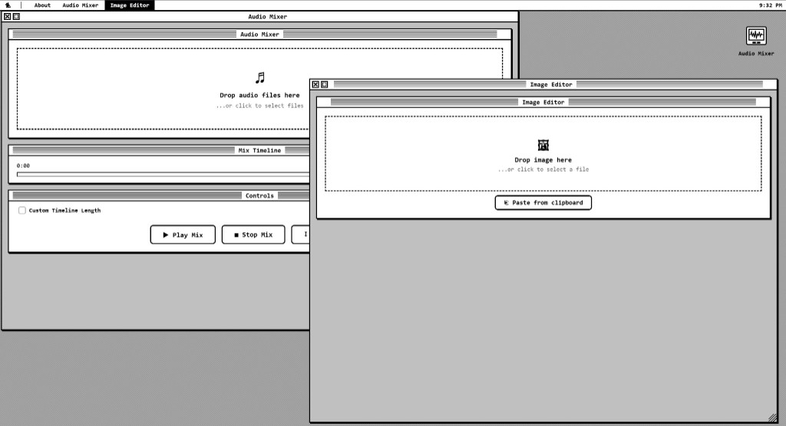

# Indie Toolbox

**[Open Indie Toolbox](https://oxygenchick.github.io/Indie-Toolbox/)**

A collection of lightweight, browser-based tools for indie developers and creators. The tools run locally in your browser. Journey Book can optionally copy dated tasks to Google Calendar; this sends task titles and dates to the selected calendar only after you connect it.

Styled after classic Macintosh System software, with a desktop environment, draggable windows, and a retro pixel aesthetic.

## Tools

**Image Editor** — Convert images between PNG, JPEG, WebP, and BMP (including HEIC/HEIF decoding). Resize, crop, and adjust quality. Drag & drop or use native file dialogs with the save path defaulting to the original file's directory.

**Audio Mixer** — Load multiple audio tracks, trim, apply fades, adjust volume, and arrange them on a shared timeline by dragging. Set custom timeline length to add pauses and gaps. Preview the mix and export to WAV.

**Journey Book** — A single local `.json` file that travels with you while you build a game: tasks (with Pomodoro), Gantt, a project painting, goals, a journal, and note cards. Define areas and shared detail layers in Painting, then assign tasks to them in the task list. The painting shows completed strokes and hatches tasks completed before earlier layers; hover a stroke to read its task. Areas, layers, task assignments, and manual task order are saved in the same JSON and support undo/redo. Drag tasks in the task list to change their order. Older files open with unassigned tasks. Removing an area or layer keeps its tasks.

### Optional Google Calendar connection

1. In [Google Calendar](https://calendar.google.com/), create a separate calendar via **Other calendars → + → Create new calendar**.
2. In [Google Cloud Console](https://console.cloud.google.com/), create a project, enable **Google Calendar API**, configure the **OAuth consent screen**, and create an **OAuth client ID** of type **Web application**. If the app is in testing mode, add your Google account as a test user.
3. Add the exact origin where you use Indie Toolbox to **Authorized JavaScript origins**. For the local preview shown in this project, that is `http://127.0.0.1:8765`; the hosted site uses `https://oxygenchick.github.io`. The scheme, host, and port must match the browser address. Open the app via HTTP(S), not a `file://` URL.
4. Open or create a Journey Book JSON file. Click **Google Calendar**, paste the OAuth **Client ID** (not the client secret), click **Connect Google**, approve access, choose the calendar, and click **Use this calendar**.

Each marked task day becomes a separate all-day event. Task title/date edits, date removal, and deletion are reflected in the selected calendar after the JSON saves. Unrelated calendar events are untouched. This is one-way sync: editing Google Calendar does not change the JSON. The chosen calendar is saved in the project JSON, the public client ID is remembered in this browser, and the short-lived access token is kept only in memory. Reconnect after reopening the page or when Google access expires. Changing the chosen calendar leaves previously copied events in the old calendar.

**Video Editor** — Preview video files, view file info (size, resolution, duration), resize with locked or free aspect ratio, trim from start or end, toggle audio on/off, and export to WebM.

**Brief Editor** — Build technical briefs as vertical content blocks: text sections and grouped images. Place images freely inside a group, annotate them with pencil/text/eraser tools, reorder sections, save/open projects locally as JSON, and export to PDF.

## License

See [LICENSE](LICENSE) for details. Free for personal and non-commercial use.
